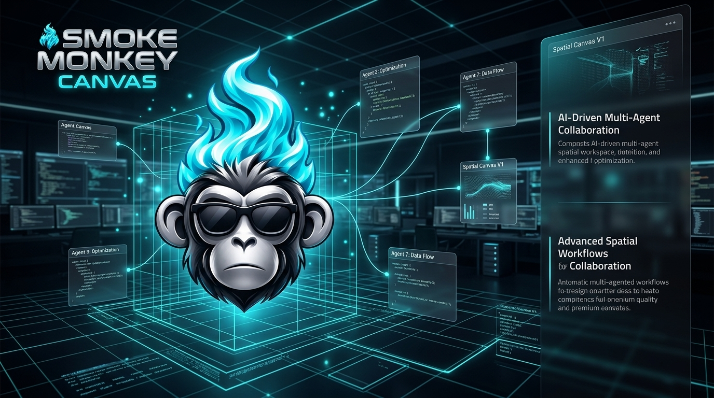

# Smoke Monkey Canvas 🐒

<p align="center">
  
</p>

> **The visual, spatial multi-agent workspace for [Smoke Monkey Harness](https://github.com/RajdeepDevelopment/smoke-monkey-harness).**
> Deploy, schedule, and chat with unlimited autonomous AI agents on an infinite canvas — all running locally with zero cloud lock-in.

[](https://github.com/RajdeepDevelopment/smoke-monkey-canvas/releases)
[](LICENSE.md)
[](https://nodejs.org/)
[](https://www.typescriptlang.org/)
[](https://www.npmjs.com/package/smoke-monkey-harness)

---

## What is Smoke Monkey Canvas?

**Smoke Monkey Canvas** is a standalone, portable visual workspace that lets you create, configure, and run multiple AI agents simultaneously on an infinite drag-and-drop canvas. Each agent has its own system prompt, model provider, cron schedule, MCP server integrations, skills library, working directory, and persistent multi-turn chat history.

It is built on top of **[smoke-monkey-harness](https://github.com/RajdeepDevelopment/smoke-monkey-harness)** — the open-source TypeScript AI agent runtime — and adds a production-grade local UI to orchestrate it visually.

### Why Canvas?

| Problem | Canvas Solution |
|---------|----------------|
| Running agents one at a time in a terminal | Parallel agents on an infinite spatial canvas |
| Losing chat history on page refresh | Persistent multi-turn sessions per agent in SQLite |
| Cron jobs polluting interactive chat threads | Separate cron execution history with `⏰` badge |
| No visual feedback during agent execution | Live streaming via WebSocket with tool call timeline |
| Hard-coded model providers | Swap providers (NVIDIA, OpenAI, Anthropic, Groq, etc.) per agent |

---

## Features

- 🗺️ **Infinite Canvas** — drag, zoom, and organize agents spatially
- 🤖 **Multi-Agent Orchestration** — run dozens of agents simultaneously, each fully isolated
- 💬 **Persistent Chat Sessions** — multi-turn conversations survive page refreshes
- ⏰ **Cron Scheduling** — schedule agents to run automatically on any cron expression
- 🔌 **MCP Server Integration** — attach any MCP server (Firecrawl, GitHub, Slack, Tavily, etc.) per agent
- 📚 **Skills Library** — attach reusable skill documents to give agents domain expertise
- 🌊 **Live Streaming** — real-time text deltas, tool calls, and reasoning via WebSocket
- 🔑 **Multi-Provider Support** — NVIDIA, OpenAI, Anthropic, Gemini, Groq, DeepSeek, Ollama, and more
- 🗄️ **Zero-Native-Deps SQLite** — uses Node.js built-in `node:sqlite` (no native compile steps)
- 📦 **Fully Portable** — copy the directory into any project and run it

---

## Architecture

```
smoke-monkey-canvas/
├── server/                    # Express + WebSocket backend (TypeScript)
│   ├── app.server.ts          # Entry point, mounts all routers
│   └── features/
│       ├── agent/             # Agent CRUD, runner, chat sessions, cron
│       │   ├── agent.server.ts    # REST API routes
│       │   ├── agent.runner.ts    # Harness execution engine
│       │   ├── agent.db.ts        # SQLite queries (runs, sessions, messages)
│       │   ├── agent.cron.ts      # Cron scheduler
│       │   └── agent.types.ts     # Shared type definitions
│       ├── core/
│       │   ├── database.db.ts     # Bootstrap, migrations, SQLite singleton
│       │   └── ws.server.ts       # WebSocket broadcast server
│       ├── mcp/               # MCP server registry & stock MCPs
│       ├── settings/          # API key management
│       ├── skill/             # Skills library management
│       └── space/             # Canvas node positions
└── web/                       # React + Vite frontend
    └── src/features/
        ├── agent/             # Agent drawer, chat UI, history tabs
        ├── space/             # Canvas renderer, node components
        └── mcp/               # MCP configuration UI
```

**Data flow:**
1. User interacts with Canvas UI (React/Vite)
2. REST calls → Express server → SQLite (agent config, chat history)
3. Agent run → `AgentRunner` → `smoke-monkey-harness` → LLM provider
4. Events stream back → WebSocket → UI live updates

---

## Quick Start

### ⚡ Option 1: Instant Launch with NPX (No Install Needed)

Run the Canvas immediately on any machine with Node.js ≥ 22:

```bash
# Start in foreground and automatically open browser
npx smoke-monkey-canvas

# Run continuously in background (daemon mode)
npx smoke-monkey-canvas --daemon

# Check background daemon status
npx smoke-monkey-canvas --status

# Stop background daemon
npx smoke-monkey-canvas --stop

# Run on a custom port
npx smoke-monkey-canvas --port 8080
```

---

### 🐳 Option 2: Docker & Docker Compose (Isolated & Containerized)

#### Using Docker Compose (Recommended)

Includes the Canvas server and an optional dedicated PostgreSQL instance running on a **unique port (`15432`)** to ensure zero conflicts with existing local databases:

```bash
# 1. Start all services in the background
docker compose up -d

# 2. View running services and health status
docker compose ps

# 3. View live server logs
docker compose logs -f canvas

# 4. Stop all services
docker compose down
```

The Web UI is accessible at **http://localhost:3333**, and SQLite database data is persisted automatically in the `smoke_canvas_data` volume.

#### Using Standalone Docker

```bash
# Build the production image
docker build -t smoke-monkey-canvas:latest .

# Run container with persistent data volume
docker run -d \
  --name smoke-monkey-canvas \
  -p 3333:3333 \
  -v smoke_canvas_data:/app/data \
  smoke-monkey-canvas:latest

# Open http://localhost:3333
```

---

### 💻 Option 3: Local Development from Source

#### Prerequisites

- **Node.js ≥ 22.0.0** (required for `node:sqlite` built-in)
- An API key for at least one LLM provider (e.g., `NVIDIA_API_KEY`, `OPENAI_API_KEY`)

#### 1. Clone & Install

```bash
git clone https://github.com/RajdeepDevelopment/smoke-monkey-canvas.git
cd smoke-monkey-canvas

# Install dependencies and build web client
npm install
npm run build
```

#### 2. Launch

```bash
npm start
```

Canvas is now running at **http://localhost:3333** 🚀

### Development Mode (hot-reload UI)

```bash
# Terminal 1 — start backend
npm start

# Terminal 2 — start frontend dev server
npm run dev:web
```

Frontend dev server runs at `http://localhost:5173` and proxies API/WS calls to the backend.

---

## Configuration

### Setting API Keys

API keys can be set two ways:

1. **Via the UI**: Open any agent → Settings → Provider → paste key
2. **Via environment variables**: Set before starting the server

```bash
# Supported environment variable names
export NVIDIA_API_KEY=nvapi-...
export OPENAI_API_KEY=sk-...
export ANTHROPIC_API_KEY=sk-ant-...
export GEMINI_API_KEY=AIza...
export GROQ_API_KEY=gsk_...
export OPENROUTER_API_KEY=sk-or-...
export DEEPSEEK_API_KEY=sk-...
```

Keys set in the UI are stored encrypted in SQLite at `~/.smoke-monkey/canvas.db`.

### Supported Providers

| Provider | Env Variable | Models |
|----------|-------------|--------|
| NVIDIA NIM | `NVIDIA_API_KEY` | `nvidia/nemotron-3-super-120b`, `meta/llama-3.3-70b-instruct`, etc. |
| OpenAI | `OPENAI_API_KEY` | `gpt-4o`, `gpt-4o-mini`, etc. |
| Anthropic | `ANTHROPIC_API_KEY` | `claude-3-5-sonnet`, `claude-opus-4`, etc. |
| Google Gemini | `GEMINI_API_KEY` | `gemini-2.0-flash`, `gemini-2.5-pro`, etc. |
| Groq | `GROQ_API_KEY` | `llama-3.1-70b-versatile`, etc. |
| DeepSeek | `DEEPSEEK_API_KEY` | `deepseek-chat`, `deepseek-reasoner` |
| Ollama | _(no key)_ | Any local model |

---

## Creating Your First Agent

1. **Click `+ New Agent`** on the canvas toolbar
2. **Name your agent** and select a model/provider
3. **Write a system prompt** describing the agent's role
4. *(Optional)* Attach **MCP servers** (e.g., Firecrawl for web research)
5. *(Optional)* Attach **skills** from the library
6. *(Optional)* Set a **cron schedule** (e.g., `0 9 * * 1-5` for weekday morning runs)
7. **Click Run** or **type in the chat** to start an interactive session

---

## Chat Sessions & History

Each agent maintains:

- **Multi-turn chat sessions** — conversations persist across page refreshes
- **Cron execution history** — isolated from interactive chats, shown with `⏰ Cron Job` badge
- **History tab filters** — view `All`, `💬 Chats`, or `⏰ Cron Jobs` separately

The **Session system** uses SQLite (`chat_sessions`, `chat_messages` tables) so conversations are never lost, even if the server restarts.

---

## REST API

The server exposes a REST API at `http://localhost:3333/api`:

| Method | Path | Description |
|--------|------|-------------|
| `GET` | `/api/agents` | List all agents |
| `POST` | `/api/agents` | Create agent |
| `GET` | `/api/agents/:id` | Get agent details |
| `PATCH` | `/api/agents/:id` | Update agent config |
| `DELETE` | `/api/agents/:id` | Delete agent |
| `POST` | `/api/agents/:id/run` | Trigger manual run |
| `POST` | `/api/agents/:id/stop` | Stop running agent |
| `GET` | `/api/agents/:id/runs` | List runs (filterable by `trigger_type`) |
| `GET` | `/api/agents/runs/:runId` | Get run details + events |
| `GET` | `/api/agents/:id/sessions` | List chat sessions |
| `POST` | `/api/agents/:id/sessions` | Create new session |
| `GET` | `/api/agents/:id/sessions/:sessionId/messages` | Get session messages |
| `DELETE` | `/api/agents/:id/sessions/:sessionId` | Delete session |
| `POST` | `/api/agents/:id/mcps` | Attach MCP server |
| `DELETE` | `/api/agents/:id/mcps/:mcpId` | Detach MCP server |
| `POST` | `/api/agents/:id/skills` | Attach skill |
| `DELETE` | `/api/agents/:id/skills/:skillId` | Detach skill |

**WebSocket:** Connect to `ws://localhost:3333/ws` for live agent events.

---

## Standalone / Embedded Use

Canvas is **fully portable**. You can embed it inside another project:

```bash
# Copy or pull the canvas directory into your project
cp -r smoke-monkey-canvas ./my-project/canvas
cd ./my-project/canvas
npm install && npm --prefix web install && npm run build:web
npm start
```

It runs completely independently with its own SQLite database, web UI, and WebSocket server.

---

## License

Smoke Monkey Canvas is released under the **[Sustainable Use License (SUL)](LICENSE.md)**.

**Summary:**
- ✅ Free to use for personal projects, research, and internal business tooling
- ✅ Free to modify and redistribute non-commercially
- ❌ You may **not** offer Canvas as a commercial hosted service or SaaS product without a commercial license
- ❌ You may **not** remove or obscure license notices

For commercial licensing, contact: [rajdeep@smokemonkey.dev](mailto:rajdeep@smokemonkey.dev)

---

## Contributing

We welcome contributions! Please read [CONTRIBUTING.md](CONTRIBUTING.md) before submitting a pull request.

- 🐛 **Found a bug?** → [Open an issue](.github/ISSUE_TEMPLATE/bug_report.md)
- 💡 **Have an idea?** → [Request a feature](.github/ISSUE_TEMPLATE/feature_request.md)
- 🔒 **Security issue?** → See [SECURITY.md](SECURITY.md)

---

## Related Projects

| Project | Description |
|---------|-------------|
| [smoke-monkey-harness](https://github.com/RajdeepDevelopment/smoke-monkey-harness) | The underlying AI agent runtime this is built on |
| [@smoke-monkey/ui](https://www.npmjs.com/package/@smoke-monkey/ui) | The streaming chat UI component library |

---

<p align="center">
  Built with ❤️ by <a href="https://github.com/RajdeepDevelopment">RajdeepDevelopment</a>
</p>
